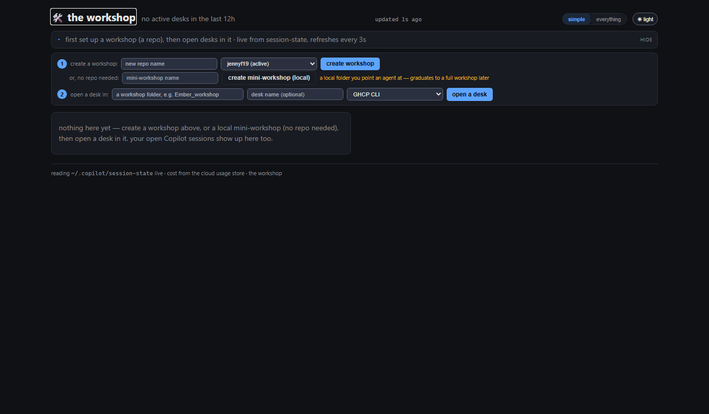
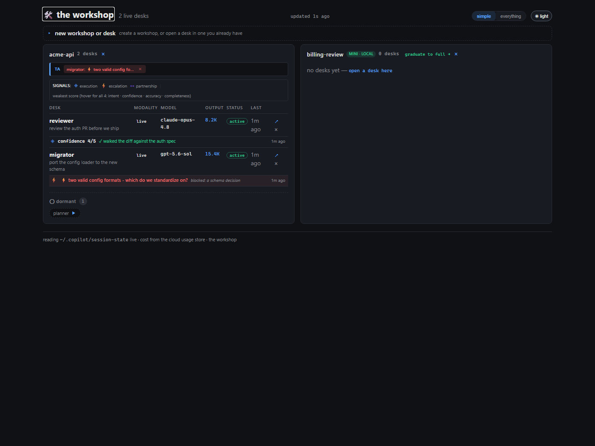

# Getting started — the simple version

The workshop puts a few long-running AI agents ("desks") in one room, on the
same work, so you **direct a team** instead of relaying between chat tabs. This
takes you from nothing to a running desk in a couple of minutes.

## The mental model (30 seconds)

- **Workshop** — a shared workspace: a repo, or a local folder. Everything in it
  shares one bench.
- **Desk** — one long-running agent with its own memory and history, opened
  *inside* a workshop. You can put several on the same problem.
- **You** — the operator. You set direction and make the calls the room can't
  settle on its own; the board tells you what actually needs you.

Reach for it when a problem wants **more than one angle, over time** — a security
review, a gnarly migration, a research question. For a quick one-off, just use
the CLI; you don't need a room for a single shot.

## 1. Run it

Either run the web app directly:

```
dotnet run --project src/WorkshopRoom
```

…or, on Windows, start the **tray launcher** — one thing to run. It starts the
server hidden, drops a 🛠️ icon by the clock (click it to open, quit its menu to
stop everything):

```
dotnet run --project src/WorkshopRoom.Tray
```

Open the URL it prints (a localhost port). The board reads your live Copilot
sessions straight from `~/.copilot/session-state` and refreshes on its own every
few seconds. It opens in **simple** view — just your desks, grouped by workshop,
with tokens and signals.

## 2. Make a workshop

On first run the setup is open and the board is empty:



Two ways to start (step ①):

- **Create a workshop** — name it, pick the owner account, hit **create
  workshop**. This creates a private repo and clones it. Use this when the work
  has a real home: history, review, a shared repo.
- **Create a mini-workshop (local)** — name it, hit **create mini-workshop**. No
  repo, no account — just a local folder you point agents at. Perfect for
  scratch; **graduate to full →** later when it gets serious.

## 3. Open a desk

In step ②: pick the workshop (or type its folder), give the desk an optional
name, choose the agent CLI, and hit **open a desk**. A terminal opens with the
agent oriented and already working inside the workshop. Repeat to put more desks
on the same problem.

> A mini-workshop isn't listed in the "open a desk in" chips (it's not a full
> workshop yet) — open its first desk from its card's **open a desk here**.

## 4. Read the board

With desks running, the board is your room at a glance:



- Each **workshop card** lists its desks: modality, model, output tokens,
  status, and when each was last seen. **↗** opens a desk's live console; **×**
  closes it.
- **Signals** are each desk's own self-report. A weak score or an **⚡
  escalation** rises into the **TA** (technical assistant) strip at the top of
  the card — the coordination layer flagging what needs a decision. Handled it?
  Dismiss it with its **×**.
- **Dormant** desks (**▶** to start) are desk folders with no live session yet.
- Flip **simple → everything** for the daily pulse, metrics, AIC, the shared
  bench, and the hands-up queue.

## 5. Close up

- **Close a desk** with its **×** — a live one winds down (it writes its journal
  first), then leaves the board. Bring it back later from **closed desks**
  (**↻**).
- **Close a workshop** with the **×** in its card header — hidden from the board
  but kept whole on disk. It tucks into **closed workshops** at the bottom;
  **↻** restores it. (Mini-workshops close the same way — or graduate them if
  they're worth keeping.)

## When to reach for it — and when not

**Reach for it when:**
- One artifact wants several perspectives (review + migration + tests, say).
- You're relaying between chat tabs and holding all the context in your head.
- The work spans sessions and you want the agents to remember.

**Skip it when:**
- It's a single quick question — the CLI alone is faster.
- There's genuinely one thing to do and one way to do it.

---

_Screenshots use a throwaway demo dataset with fake names. Regenerate them with
`tools/seed-demo.ps1` (see the script header), then point an instance at it via
the `WORKSHOP_DIR` / `WORKSHOP_SESSION_ROOT` environment variables._
